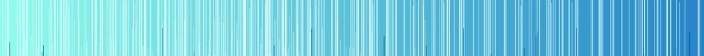

<h1>Welcome!</h1> 
<h3>My name is Alexander, and I am a <b>Data Scientist</b> / <b>ML Engineer</b> </h3> 

Before diving into the world of IT, my career path was related to economic research: I looked for causal relationships in data on international trade, freight transportation, migration, airline ticket sales, and so on. This allowed me to develop professional intuition, which now helps me in solving various tasks using DS.
 
<h3>Among the tools I use:</h3>

  
  
  
  
  
   
  
  
  
  
  
  
  
  
  
  
  
    

 Beyond classical ML, I have experience with DL (neural networks). This includes creating image embeddings and performing object detection. I also work with text vectorization and classification. I have applied Transformer architectures among others. 

<!-- 

 

-->

  

Among the books I've read:

Python  
- Lutz M.: Python Pocket Reference  
- Lubanovic B.: Introducing Python: Modern Computing in Simple Packages  
- Aditya Y. Bhargava: Grokking Algorithms  
- Swaroop C.H.: A Byte of Python  

Machine Learning  
- Albon C.: Machine Learning with Python Cookbook: Practical Solutions from Preprocessing to Deep Learning  
- Müller A.C., Guido S.: Introduction to Machine Learning with Python: A Guide for Data Scientists  
- Васильев Ю.: Python для Data Science  
- Serrano L.: Grokking Machine Learning
